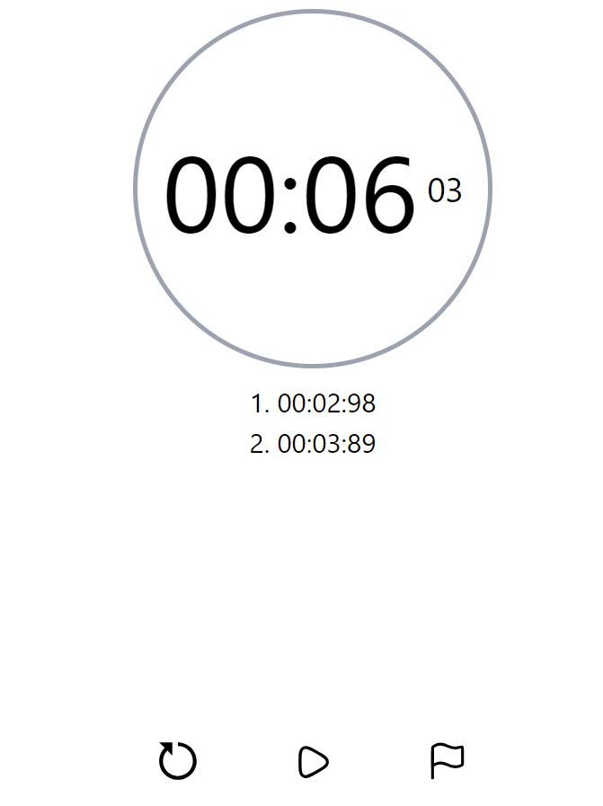

# StopWatch - User-Friendly Time Tracker

A user-friendly stopwatch application built with **HTML**, **CSS (Tailwind)**, and **JavaScript**. The stopwatch offers an intuitive interface, clear display, and a responsive design that adapts seamlessly to any device.

## Table of Contents
- [Preview](#preview)
- [Features](#features)
- [Technologies Used](#technologies-used)
- [Usage](#usage)
- [Deployment](#deployment)
- [Contact](#contact)
- [Acknowledgments](#acknowledgments)

---

## Preview

#### 1.

#### 2.

---

## Features

### Core Functionality:
- **Start/Stop Timer**: Allows users to start and stop the timer at the click of a button.
- **Reset Functionality**: Quickly reset the timer to zero for a fresh start.
- **Lap Timing**: Records and displays lap times for better time tracking.

### Design:
- **Responsive Layout**: Developed using **Tailwind CSS**, ensuring adaptability across all devices.
- **Clear Display**: Large, visually appealing numbers for easy readability.
- **Minimalist UI**: Focused on simplicity and ease of use.

---

## Technologies Used
- **Frontend**: HTML, Tailwind CSS.
- **Logic**: JavaScript for timer functionality and user interactions.

---

## Usage

### Using the Stopwatch:
1. **Access the Stopwatch**:
   - Open the deployed application or run it locally in your browser.

2. **Start/Stop Timer**:
   - Click the "Start" button to begin the timer. Toggle "Stop" to pause the timer.

3. **Reset Timer**:
   - Use the "Reset" button to reset the stopwatch to zero.

4. **Record Laps**:
   - Click the "Lap" button to record the current time.

---

## Deployment
The project is deployed and accessible at https://rohanbhoge.github.io/tictactoe/

---

## Contact

Feel free to reach out to me through the following channels:

- **Email**: bhogerohan60@gmail.com
- **GitHub**: https://github.com/RohanBhoge
- **LinkedIn**: https://www.linkedin.com/in/rohanbhoge/

---

## Acknowledgments
- Thanks to the **Tailwind CSS** framework for simplifying the design process.
- Gratitude to the **JavaScript** community for sharing resources and tutorials.
